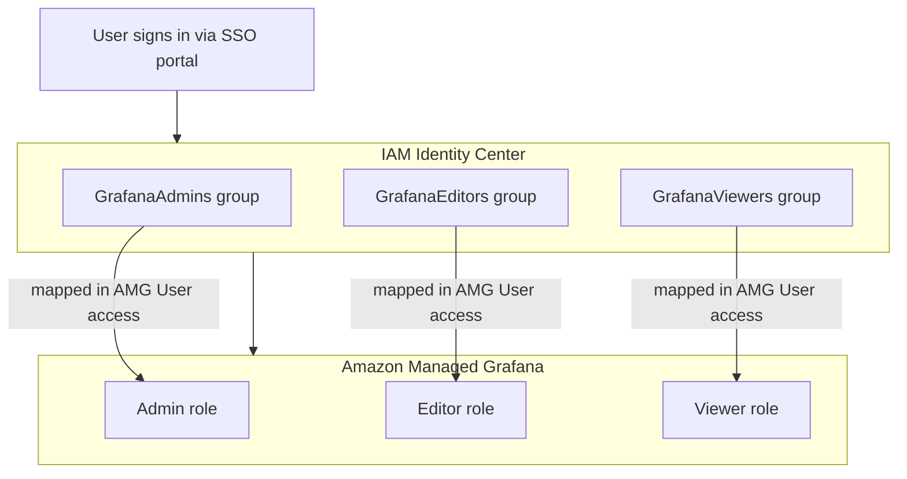

# Grafana guide (AMG + IAM Identity Center + this repo)

This guide describes the **typical enterprise setup** for **Amazon Managed Grafana (AMG)** with **AWS IAM Identity Center** (formerly AWS SSO): groups in Identity Center map to Grafana roles so users get **Admin**, **Editor**, or **Viewer** access automatically after SSO login.

It also ties that model to **this CDK project** (intent → query builders → **`POST /visualize`**), including how **human SSO access** differs from **Lambda service-account** access.

**Related docs in this repo**

- **[README.md](./README.md)** — API, `POST /visualize`, stage-aware Grafana (`local` Docker vs AMG).
- **[LOCALSTACK.md](./LOCALSTACK.md)** — LocalStack deploy + **§ 5** local Grafana Docker.
- **[docker/grafana/README.md](./docker/grafana/README.md)** — Local Grafana compose stack (not AMG).
- **[code_generation_context_2.md](./code_generation_context_2.md)** — Original visualization design notes.

---

## End state (what you are building)



**Result**

- **AWS IAM Identity Center group** → **mapped to a Grafana role** in the AMG workspace.
- Users automatically receive **Admin**, **Editor**, or **Viewer** in Grafana (no separate Grafana password for humans).

---

## Step 1 — Enable IAM Identity Center

In the **AWS Console**:

1. Open **IAM Identity Center**.
2. Choose **Enable** (if not already enabled).

AWS provisions (at a high level):

- An **identity store** (users and groups).
- An **SSO / access portal** URL for your organization.
- A **directory** of users and groups you manage in Identity Center.

**Note:** Enabling Identity Center is typically a **once-per-organization** (or once-per-management-account) operation. Your org’s cloud admin may already have done this.

---

## Step 2 — Create users

In **IAM Identity Center**:

1. **Users** → **Add user**.

Example identities (illustrative):

| User            | Notes        |
| --------------- | ------------ |
| `alice@company.com` | Platform ops |
| `bob@company.com`   | Analyst      |

---

## Step 3 — Create groups

In **IAM Identity Center**:

1. **Groups** → **Create group**.

Suggested groups for Grafana:

| Group name        | Purpose                          |
| ----------------- | -------------------------------- |
| `GrafanaAdmins`   | Full Grafana workspace management |
| `GrafanaEditors`  | Create and edit dashboards/panels |
| `GrafanaViewers`  | Read-only access to dashboards    |

Name the groups to match how your org names teams (`grafana-admins`, etc.); the **mapping in AMG** (next steps) is what matters.

---

## Step 4 — Add users to groups

Example:

| User  | Group           |
| ----- | --------------- |
| Alice | `GrafanaAdmins` |
| Bob   | `GrafanaViewers` |

**Production best practice:** prefer **group-based** access over assigning individual users everywhere. It scales and matches how enterprises audit access.

---

## Step 5 — Create an Amazon Managed Grafana workspace

### Option A — This repo’s CDK (`GrafanaWorkspaceConstruct`)

This project can create an AMG workspace on **`dev` / `test` / `prod`** when you opt in (see **`lib/grafana-workspace-construct.ts`** and **`lib/business-domain-human-query-stack.ts`**).

**`cdk.json` (excerpt)** — set `humanQuery.grafana.aws.createWorkspace` to `true` and tune name/description:

```json
{
  "context": {
    "humanQuery": {
      "grafana": {
        "aws": {
          "createWorkspace": true,
          "workspaceName": "human-query-dev",
          "authenticationProviders": ["AWS_SSO"],
          "permissionType": "SERVICE_MANAGED",
          "dataSources": ["CLOUDWATCH", "XRAY"],
          "notificationDestinations": ["SNS"]
        }
      }
    }
  }
}
```

**CLI one-shot** (flat context key; nested `humanQuery:grafana:...` is not merged by CDK):

```bash
npx cdk deploy --all -c stage=dev -c createGrafanaWorkspace=true
```

**Point at an existing workspace** (no `CfnWorkspace`):

```bash
npx cdk deploy --all -c stage=dev -c grafanaUrl=https://g-xxxxxx.grafana-workspace.us-east-1.amazonaws.com
```

After deploy, the stack emits **`GrafanaUrl`**, **`GrafanaBacking`**, and **`GrafanaMode`** (see **[README.md](./README.md)**). The **`GrafanaVisualizeFn`** Lambda receives **`GRAFANA_URL`** pointing at that workspace.

### Option B — Minimal CDK snippet (conceptual)

Equivalent to what **`CfnWorkspace`** does in this repo:

```typescript
import * as cdk from "aws-cdk-lib";
import * as grafana from "aws-cdk-lib/aws-grafana";

export class GrafanaStack extends cdk.Stack {
  constructor(scope: cdk.App, id: string, props?: cdk.StackProps) {
    super(scope, id, props);

    new grafana.CfnWorkspace(this, "GrafanaWorkspace", {
      name: "ai-observability",
      description: "AI observability workspace",
      authenticationProviders: ["AWS_SSO"],
      permissionType: "SERVICE_MANAGED",
      accountAccessType: "CURRENT_ACCOUNT",
      dataSources: ["CLOUDWATCH", "XRAY"],
    });
  }
}
```

Deploy:

```bash
cdk deploy
```

---

## Step 6 — Open the Grafana workspace

In the **AWS Console**:

1. **Amazon Managed Grafana** → **Workspaces**.
2. Open your workspace and use the **Grafana workspace URL** (or the URL from CDK output **`GrafanaUrl`**).

---

## Step 7 — Assign IAM Identity Center groups to the workspace

Inside the workspace in the console:

1. **User access** (or **Authentication / assignments**, depending on console wording).
2. **Assign new user or group**.
3. Choose **IAM Identity Center groups** (and/or users if you must).

You should see Identity Center **users** and **groups** available for assignment.

---

## Step 8 — Map groups to Grafana roles (key step)

Assign each Identity Center **group** to a **Grafana role** in the AMG workspace:

| IAM Identity Center group | Grafana role |
| ------------------------- | ------------ |
| `GrafanaAdmins`           | **Admin**  |
| `GrafanaEditors`          | **Editor** |
| `GrafanaViewers`          | **Viewer** |

This mapping is stored **inside Amazon Managed Grafana**. After this:

- **AWS IAM Identity Center** handles **authentication** (who the user is).
- **AMG** applies **authorization** (what Grafana role they get), based on group membership.

---

## Step 9 — Test login (user flow)

Typical flow:

1. User opens the **AWS access portal** (IAM Identity Center).
2. User launches the **Grafana** application / workspace link.
3. Grafana opens with the **mapped role** applied.

Examples:

| User  | Group           | Effective Grafana role |
| ----- | --------------- | ---------------------- |
| Alice | `GrafanaAdmins` | **Admin**              |
| Bob   | `GrafanaViewers`| **Viewer**             |

There is **no separate Grafana password** for these human users when using **`AWS_SSO`** as the authentication provider.

---

## What each Grafana role can do (high level)

| Grafana role | Typical permissions |
| ------------ | ------------------- |
| **Admin**    | Manage workspace settings, users/groups assignment in Grafana, data sources, plugins, and all dashboards. |
| **Editor**   | Create and edit dashboards, panels, alerts; use data sources granted to the workspace. |
| **Viewer**   | Open dashboards and explore (read-only); cannot save destructive workspace-wide changes. |

Exact UI labels can vary slightly by Grafana version; AMG tracks the managed Grafana release in your workspace.

---

## Important AWS detail (auth vs authz)

- **IAM Identity Center** proves **identity** and issues SSO sessions for humans.
- **AMG** stores the **group → Grafana role** mapping and enforces **Grafana permissions** inside the workspace.

So: **SSO for people**, **AMG for Grafana authorization**.

---

## Production best practice (groups, not individuals)

| Approach | Verdict |
| -------- | ------- |
| Assign **`GrafanaAdmins`** → **Admin** | Good — auditable, scalable |
| Assign **`alice@company.com`** → **Admin** | Works for a lab, but **does not scale** as headcount grows |

Prefer **groups only** for ongoing operations.

---

## Recommended split for this “AI observability” project

### Humans (SSO)

- **Viewers**: run investigations, open dashboards, use any “human query” UI that deep-links into Grafana with `?var-dynamicQuery=...`.
- **Editors**: maintain the canonical dashboards (e.g. panels that reference **`${dynamicQuery}`**).
- **Admins**: workspace configuration, data source changes, plugin enablement (e.g. Image Renderer if you use server-side `render: true`).

### Automation (`POST /visualize` Lambda)

Human **SSO sessions** are **not** how the Lambda calls Grafana HTTP APIs.

For **`panel_patch`** and **`render: true`**, the Lambda uses a **Grafana HTTP API token** (service account) via:

- **`GRAFANA_API_KEY`** (plain env, avoid in prod), or
- **`GRAFANA_API_KEY_SECRET_ARN`** (Secrets Manager; CDK grants read when ARN is set).

**Default `mode: "variable"`** only builds a URL; the **user’s browser** uses their **SSO** session when they open the link. The Lambda does not need a token for that path.

See **[README.md § Grafana](./README.md#grafana--stage-aware-backing)** for the full matrix (when the Lambda actually performs HTTP vs browser-only).

---

## `stage=local` vs AMG (this repo)

| Stage | Grafana target | Human auth |
| ----- | -------------- | ---------- |
| **`local`** | **Docker Grafana** (`npm run grafana:local:up`) | **Anonymous Admin** for local dev only (see **`docker/grafana/README.md`**). |
| **`dev` / `test` / `prod`** | **AMG** (created or existing URL) | **IAM Identity Center** → group → Grafana role (this guide). |

Do **not** copy anonymous-admin settings from local Docker into AMG.

---

## Optional advanced automation (later)

You can eventually automate assignments using:

- **Terraform** / **AWS CloudFormation** (where supported for AMG assignment resources),
- **AWS APIs** for Identity Center and/or Grafana,
- **SCIM** provisioning from an external IdP (**Okta**, **Microsoft Entra ID**, etc.).

For most teams, **manual group assignment in AMG** is the fastest first milestone; add automation when the org matures.

---

## Final result (enterprise pattern)

You end up with:

```text
AWS IAM Identity Center
    ├── GrafanaAdmins   ──► AMG: Admin
    ├── GrafanaEditors  ──► AMG: Editor
    └── GrafanaViewers  ──► AMG: Viewer

Amazon Managed Grafana
    └── Automatic role-based access after SSO login
```

That is the standard **AWS-native Grafana** pattern for organizations using **IAM Identity Center** with **Amazon Managed Grafana**.

---

## Quick checklist before first AMG deploy from this repo

1. **IAM Identity Center enabled** in the account/org.
2. **Groups created** and **users assigned** to groups.
3. **CDK deploy** with workspace creation or existing **`grafanaUrl`**.
4. In **AMG console**: **assign groups** and **map to Grafana roles** (Admin / Editor / Viewer).
5. For Lambda API paths: create a **Grafana service account** + token, store in **Secrets Manager**, set **`GRAFANA_API_KEY_SECRET_ARN`** on **`GrafanaVisualizeFn`** (see **[README.md](./README.md)**).
